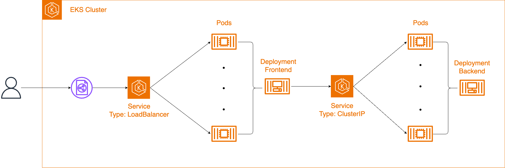

# Lab - Deploy Applications on Amazon Elastic Kubernetes Service (EKS)

This lab demonstrates how to deploy a containerized application on Amazon Elastic Kubernetes Service (EKS) with a microservices architecture consisting of a frontend and backend service.

## 📋 Overview

This project showcases the deployment of a sample application on AWS EKS with the following components:
- **Frontend**: Python Flask application
- **Backend**: .NET Core application
- **Database**: Amazon DynamoDB
- **Infrastructure**: EKS cluster with managed node groups



The application follows a microservices architecture:

```
┌─────────────────┐    ┌─────────────────┐    ┌─────────────────┐
│   Frontend      │    │    Backend      │    │   DynamoDB      │
│   (Flask)       │◄──►│   (.NET Core)   │◄──►│   (Employees)   │
│   Port: 80      │    │   Port: 80      │    │   Table         │
└─────────────────┘    └─────────────────┘    └─────────────────┘
         │                       │
         ▼                       ▼
┌─────────────────┐    ┌─────────────────┐
│ LoadBalancer    │    │ ClusterIP       │
│ Service         │    │ Service         │
└─────────────────┘    └─────────────────┘
```

### Components:
- **EKS Cluster**: `eks-lab-cluster` with Kubernetes version 1.32
- **Node Group**: `worknodes-1` using t3.medium instances (2-3 nodes)
- **Frontend Service**: LoadBalancer type exposing port 80
- **Backend Service**: ClusterIP type for internal communication
- **DynamoDB Table**: `Employees` table for data storage

## 📁 Project Structure

```
Lab - Deploy Applications on Amazon Elastic Kubernetes Service (EKS)/
├── README.md                           # This file
├── detail.sh                          # Main deployment script
├── k8s-architecture.png               # Architecture diagram
└── environment/
    ├── cluster.yaml                   # EKS cluster configuration
    ├── deployment-frontend.yaml       # Frontend deployment
    ├── deployment-backend.yaml        # Backend deployment
    ├── service-frontend.yaml          # Frontend service
    └── service-backend.yaml           # Backend service
```

## ⚙️ Prerequisites

Before running this lab, ensure you have:

1. **AWS CLI** configured with appropriate permissions
2. **eksctl** installed and configured
3. **kubectl** installed
4. **jq** installed for JSON parsing
5. **AWS Account** with permissions to create:
   - EKS clusters
   - DynamoDB tables
   - S3 buckets (for source code)
   - IAM roles and policies

## 🚀 Quick Start

### 1. Environment Setup

```bash
# Clone or download this repository
cd "Lab - Deploy Applications on Amazon Elastic Kubernetes Service (EKS)"

# Make the deployment script executable
chmod +x detail.sh
```

### 2. Deploy the Application

Run the main deployment script:

```bash
./detail.sh
```

This script will:
1. Detect your AWS region and account ID
2. Create the EKS cluster using `cluster.yaml`
3. Configure kubectl
4. Create DynamoDB table
5. Deploy frontend and backend applications
6. Configure services and load balancers

## 📖 Manual Deployment Steps

If you prefer to deploy manually, follow these steps:

### Step 1: Create EKS Cluster

```bash
# Set your AWS region
export AWS_REGION=your-region

# Create the cluster
eksctl create cluster -f environment/cluster.yaml
```

### Step 2: Create DynamoDB Table

```bash
aws dynamodb create-table \
  --table-name Employees \
  --attribute-definitions AttributeName=id,AttributeType=S \
  --key-schema AttributeName=id,KeyType=HASH \
  --provisioned-throughput ReadCapacityUnits=1,WriteCapacityUnits=1
```

### Step 3: Deploy Applications

```bash
# Deploy frontend
kubectl apply -f environment/deployment-frontend.yaml
kubectl apply -f environment/service-frontend.yaml

# Deploy backend
kubectl apply -f environment/deployment-backend.yaml
kubectl apply -f environment/service-backend.yaml
```

## 🔍 Verification Commands

### Check Cluster Status

```bash
# Verify cluster is running
eksctl get cluster --region $AWS_REGION

# Check node groups
eksctl get nodegroup --cluster=eks-lab-cluster --region $AWS_REGION
```

### Check Application Status

```bash
# View all deployments, services, and pods
kubectl get deployment,service,pod --all-namespaces

# Check specific services
kubectl get service frontend --output wide
kubectl get service backend --output wide

# View pod logs
kubectl logs -l app=frontend
kubectl logs -l app=backend
```

### Check DynamoDB

```bash
# List DynamoDB tables
aws dynamodb list-tables --region $AWS_REGION
```

## 🌐 Accessing the Application

Once deployed, you can access the application:

1. **Frontend**: Use the LoadBalancer URL provided by the frontend service
2. **Backend**: Accessible internally via `http://backend.default.svc.cluster.local`

To get the frontend URL:

```bash
kubectl get service frontend
```

## 🔧 Configuration Details

### Cluster Configuration (`cluster.yaml`)
- **Cluster Name**: `eks-lab-cluster`
- **Kubernetes Version**: 1.32
- **Node Group**: `worknodes-1`
- **Instance Type**: t3.medium
- **Node Count**: 2-3 nodes (scalable)

### Frontend Configuration
- **Image**: python:3.10-slim
- **Port**: 80
- **Replicas**: 2
- **Service Type**: LoadBalancer
- **Source**: Downloaded from S3 bucket

### Backend Configuration
- **Image**: mcr.microsoft.com/dotnet/sdk:6.0
- **Port**: 80
- **Replicas**: 2
- **Service Type**: ClusterIP
- **Source**: Downloaded from S3 bucket

## 🧹 Cleanup

To clean up all resources:

```bash
# Delete the EKS cluster
eksctl delete cluster --name=eks-lab-cluster --region $AWS_REGION

# Delete DynamoDB table
aws dynamodb delete-table --table-name Employees --region $AWS_REGION
```

## 📝 Notes

- The applications download source code from S3 buckets during deployment
- Frontend communicates with backend via internal Kubernetes DNS
- Backend connects to DynamoDB for data persistence
- Service accounts are configured for AWS service access
- The cluster uses managed node groups for easier scaling and maintenance


## 📄 License

This project is for educational purposes as part of AWS EKS lab exercises.
